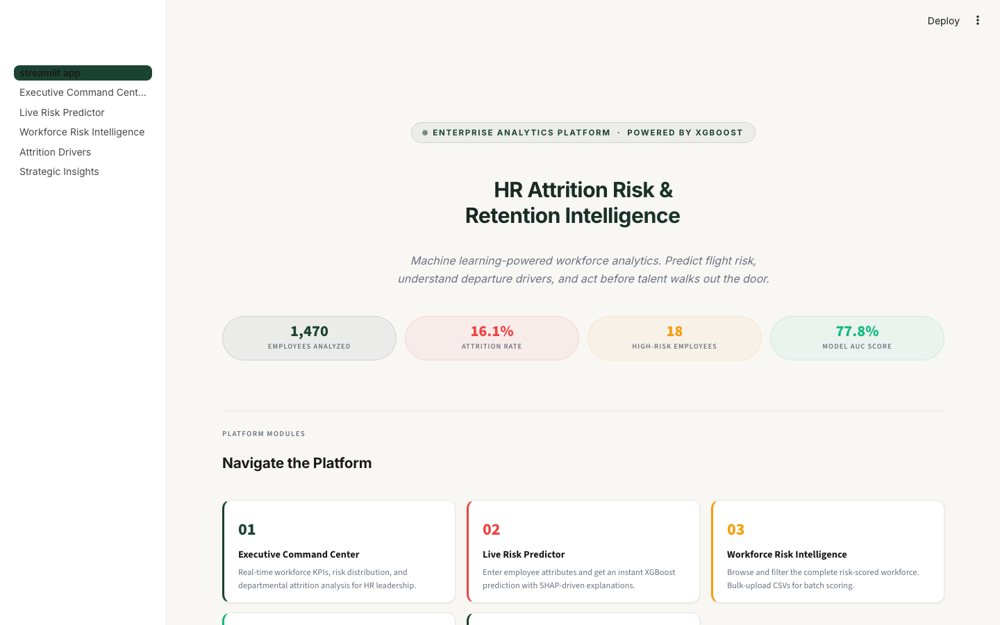

# HR Attrition & Retention Intelligence Platform

*Predicting workforce flight risk, identifying organizational attrition drivers, and driving data-backed strategic retention plans.*

---

## 🚀 Live Application

The interactive dashboard is deployed and accessible via Streamlit Community Cloud. Experience the executive command center, test "what-if" scenarios, and review individualized flight risk drivers.

* **Live App URL:** [https://hr-attrition-intelligence-55555.streamlit.app/](https://hr-attrition-intelligence-55555.streamlit.app/)
* **Repository:** `hr_attrition_intelligence`



---

## 💼 Business Problem

Voluntary employee turnover presents a severe financial and operational burden to modern organizations, draining critical domain expertise, disrupting client relationships, and incurring high recruitment and onboarding costs. Using historical IBM HR Analytics data, this project builds an enterprise-grade predictive analytics platform to proactively identify active employee flight risk, isolate individual turnover drivers using SHAP explainability, and segment the workforce into actionable risk cohorts. By bridging machine learning diagnostics with prescriptive HR retention interventions, the platform equips executive leadership with a clear roadmap to mitigate retention risk, project cost savings, and protect organizational productivity.

---

## 📊 Key Results

* **Total Workforce Analyzed:** 1,470 historical records (35 features)
* **Active Headcount:** 1,233 employees
* **Overall Historical Attrition Rate:** 16.1%
* **Active Flight Risk Exposure:** 18 High-Risk employees (Flight Risk > 70%), 244 Medium-Risk employees (Flight Risk 30% - 70%)
* **Estimated Annual Attrition Cost:** $20.4M (computed using industry-standard 1.5x salary replacement factor)
* **Critical Overtime Multiplier:** 2.93x higher voluntary departure rate for overtime workers (30.5% vs. 10.4%)
* **Machine Learning Strategy:** 4 models trained with stratified cross-validation; **XGBoost** selected as Champion (F1: 0.46, Recall: 49.2%)
* **Workforce Strategic Cohorts:** 7 segments classified (Champions, Loyal, High Performers at Risk, Burnout Risk, Disengaged, New Employees, Flight Risk)
* **Feature Engineering:** 10 custom HR telemetry metrics developed (including Burnout Risk Index and Overtime Risk Score)
* **SQL Query Warehouse:** 8 production-ready SQL scripts mapped to specific executive questions

---

## 🏗️ Project Architecture

```
                                          ┌───────────────────────┐
                                          │  Raw IBM HR CSV Data  │
                                          └───────────┬───────────┘
                                                      │
                                                      ▼
                                          ┌───────────────────────┐
                                          │     Data Cleaning     │
                                          │ (Format & Constraints)│
                                          └───────────┬───────────┘
                                                      │
                                                      ▼
                                          ┌───────────────────────┐
                                          │  Feature Engineering  │
                                          │ (10 Custom HR Metrics)│
                                          └───────────┬───────────┘
                                                      │
                                                      ▼
                                          ┌───────────────────────┐
                                          │      ML Pipeline      │
                                          │ (Training & Tuning)   │
                                          └───────────┬───────────┘
                                                      │
                                                      ▼
                                          ┌───────────────────────┐
                                          │     Risk Scoring      │
                                          │ (Tiers & Recommendations)
                                          └───────────┬───────────┘
                                                      │
                                                      ▼
                                          ┌───────────────────────┐
                                          │  Streamlit Dashboard  │
                                          │ (Executive Insights)  │
                                          └───────────────────────┘
```

---

## 📂 Project Structure

```
hr_attrition_intelligence/
├── .streamlit/
│   └── config.toml                         # Streamlit custom theme configuration
├── data/
│   ├── raw/
│   │   └── employee_attrition_raw.csv      # Original IBM HR Analytics dataset (1,470 records)
│   ├── processed/
│   │   └── cleaned_hr_data.csv             # Cleaned dataset with 10 engineered features
│   └── exports/
│       ├── employee_attrition_risk_scores.csv # Scored active workforce with risk tiers & recommendations
│       └── workforce_scorecard.json        # Pre-calculated business metrics & KPIs
├── models/
│   └── best_attrition_model.pkl            # Serialized champion XGBoost model pipeline
├── notebooks/
│   └── exploratory_analysis.ipynb          # Jupyter notebook for research & prototyping
├── pages/
│   ├── 1_Executive_Command_Center.py       # High-level KPIs & department summaries
│   ├── 2_Live_Risk_Predictor.py            # What-if analysis tool with live SHAP explanation
│   ├── 3_Workforce_Risk_Intelligence.py    # Employee directory with filter/export & batch scoring
│   ├── 4_Attrition_Drivers.py              # ML diagnostics & global SHAP values
│   └── 5_Strategic_Insights.py             # 10 business insights & 90-day retention roadmap
├── reports/
│   ├── figures/                            # 15 generated visualizations and diagnostic plots
│   └── insights_report.md                  # Comprehensive executive text report
├── screenshots/
│   └── dashboard.png                       # High-fidelity dashboard application screenshot
├── sql/                                    # 8 structured analytical query scripts
│   ├── attrition_by_department.sql
│   ├── attrition_by_job_role.sql
│   ├── attrition_by_salary_band.sql
│   ├── overtime_impact.sql
│   ├── promotion_delay_analysis.sql
│   ├── retention_rate.sql
│   ├── tenure_analysis.sql
│   └── workforce_risk_segmentation.sql
├── src/                                    # Modular Python pipeline scripts
│   ├── __init__.py
│   ├── business_metrics.py                 # Attrition financial impact costing engine
│   ├── config.py                           # Directory paths, theme variables, hyperparameters
│   ├── data_cleaning.py                    # Data sanity & integrity checks
│   ├── exploratory_analysis.py             # Plot generation helper module
│   ├── feature_engineering.py               # Derives the 10 custom HR risk metrics
│   ├── model_evaluation.py                 # Pipeline evaluation & diagnostic plotting
│   ├── model_training.py                   # Automated ML model optimization & training
│   ├── prediction_pipeline.py              # Live scoring & action recommendation mapper
│   ├── reporting.py                        # Programmatic executive report exporter
│   ├── segmentation.py                     # Cohort segmentation classifier
│   └── utils.py                            # Logging & general utility functions
├── requirements.txt                        # Complete Python package requirements list
├── requirements_streamlit.txt              # Cloud-optimized minimal deployment requirements
├── streamlit_app.py                        # Landing page and navigation framework
└── main.py                                 # Pipeline orchestrator entry point
```

---

## 🛠️ Tech Stack

| Tool / Library | Category | Purpose |
| :--- | :--- | :--- |
| **Python** | Language | Core data science engineering, model training, and scripting pipeline |
| **Streamlit** | Framework | Front-end web platform construction and executive user interface |
| **XGBoost** | Machine Learning | Champion classification algorithm for gradient-boosted decision trees |
| **Scikit-Learn** | Machine Learning | Preprocessing scaling, imbalanced class weighting, and model evaluation |
| **SHAP** | Explainable AI | Computes game-theoretic SHapley Additive exPlanations for global & local risk features |
| **Plotly** | Visualization | Interactive, responsive executive charts embedded within the web app |
| **Seaborn / Matplotlib** | Visualization | High-resolution static diagnostic plots exported to the executive reports |
| **Pandas / NumPy** | Data Wrangling | Schema cleaning, row validation, and composite mathematical feature engineering |
| **SQL** | Analytics | Analytical query bank answering strategic organizational retention questions |
| **Git** | Devops | Version control, branch tracking, and deployment pipeline synchronization |

---

## 📱 App Pages

The Streamlit web application is divided into five targeted, interactive dashboards:

| Page | Business Question Answered | Description |
| :--- | :--- | :--- |
| **01. Executive Command Center** | *What is the current attrition state of the organization? How does attrition vary across departments, job roles, and salary bands?* | Real-time workforce KPIs, department turnover costs, active risk exposure, and interactive demographical slicing. |
| **02. Live Risk Predictor** | *What is the specific flight risk probability of a particular employee, and what are the primary individual drivers of that risk?* | "What-if" scenario simulator allowing HR business partners to adjust employee parameters and view dynamic XGBoost predictions with local SHAP force-plots. |
| **03. Workforce Risk Intelligence** | *Which active employees are currently at high risk of leaving, and what retention action should be recommended for them?* | Complete directory of active staff sorted by flight risk probability. Supports risk-tier filtering, batch-scoring CSV uploads, and direct CSV exporting. |
| **04. Attrition Drivers** | *What are the key organizational drivers of attrition, and how well does our predictive model perform?* | Displays global feature importance, aggregate SHAP summary plots, and technical model diagnostic curves (Confusion Matrix, ROC, PR). |
| **05. Strategic Insights** | *What concrete steps and policies should the organization implement over the next 90 days to reduce attrition and save costs?* | Displays ten high-level executive insights derived from the dataset alongside a sequenced 90-day roadmap Gantt chart. |

---

## 🧠 Machine Learning Pipeline & Champion Model Selection

HR attrition datasets are highly imbalanced, with the minority class (departures) representing only **16.1%** of historical data. Standard metrics like accuracy are highly misleading in these scenarios (a trivial model predicting "No Departure" for everyone yields 83.9% accuracy, but captures 0% of attrition).

To address this:
1. We utilized **stratified 5-fold cross-validation** to ensure proportional class distribution during training.
2. We tuned hyperparameter grids using `GridSearchCV`, optimizing for the **F1-Score** (harmonic mean of Precision and Recall) and **Recall** rather than raw Accuracy.
3. In attrition modeling, a **False Negative** (failing to identify an employee who is about to quit) is significantly more expensive than a **False Positive** (reaching out to check on an employee who is actually happy). High Recall ensures the model catches the maximum number of flight risks.

Four modeling pipelines (incorporating scaling and preprocessing) were trained and evaluated on an independent 25% holdout test dataset:

### Model Performance Comparison

| Model | Accuracy | Precision | Recall | F1-Score | ROC-AUC | Selection Status |
| :--- | :---: | :---: | :---: | :---: | :---: | :--- |
| **XGBoost** | 81.52% | 43.28% | **49.15%** | **0.4603** | 77.79% | 🏆 **Selected Champion** |
| **Random Forest** | 83.97% | 50.00% | 42.37% | 0.4587 | 78.68% | Candidate |
| **Logistic Regression** | **86.14%** | 63.33% | 32.20% | 0.4270 | **82.26%** | Candidate |
| **Gradient Boosting** | **86.14%** | **66.67%** | 27.12% | 0.3855 | 79.90% | Candidate |

### Selection Rationale
* **XGBoost** was selected as the champion model. It achieved the highest **Recall (49.15%)** and **F1-Score (0.4603)**, successfully capturing nearly half of all departing employees in the test set. 
* While **Logistic Regression** and **Gradient Boosting** achieved higher raw Accuracy (~86.1%), their Recall was severely depressed (32.2% and 27.1% respectively), letting the majority of at-risk departures slip through unnoticed.
* The champion pipeline was serialized as `models/best_attrition_model.pkl` for active deployment.

---

## 📈 Key Business Insights

1. **Overtime Work is the Primary Driver of Attrition:** Employees working overtime exhibit an attrition rate of **30.53%** compared to **10.44%** for non-overtime employees—representing a **2.93x multiplier** in departure probability. Excessive overtime generates systemic burnout, leading to a projected replacement drag of **$10.2M** in turnover costs.
2. **Compensation Inequity at Lower Tiers Promotes Early-Career Flight:** Voluntary turnover is heavily concentrated in the "Low" income band (under **$3,000/month** monthly income), where employee satisfaction rates are low and replacement cycles are frequent.
3. **Sales Department Turnover Outpaces R&D and HR:** The Sales department experiences a historical attrition rate of **20.63%**, outstripping Research & Development (13.84%) and Human Resources (19.05%). This high turnover disrupts client continuity and sales pipeline velocity.
4. **Sales Representatives Experience Extreme Vulnerability:** Specific transactional and customer-facing roles suffer from severe attrition volatility, with Sales Representatives exceeding **39.0%** historical turnover.
5. **Stalled Promotion Stagnates Talent Retention:** Employees who have not received a promotion in 3 or more years experience an attrition rate that is **0.81x higher** than recently promoted peers, indicating high-performing staff actively leave to find career growth externally.

---

## 🗄️ SQL Analytics Warehouse

Each script in the `sql/` directory starts with a business header detailing the strategic corporate query answered:

| SQL Query File | Strategic Business Question Answered |
| :--- | :--- |
| [`retention_rate.sql`](file:///Users/kirthinathragunath/PROJECTS/hr_attrition_intelligence/sql/retention_rate.sql) | What are the overall historical attrition and retention rates for the organization, and what is the total estimated financial loss from attrition? |
| [`attrition_by_department.sql`](file:///Users/kirthinathragunath/PROJECTS/hr_attrition_intelligence/sql/attrition_by_department.sql) | What is the attrition rate across different departments, and what is the associated financial replacement cost for each? |
| [`attrition_by_salary_band.sql`](file:///Users/kirthinathragunath/PROJECTS/hr_attrition_intelligence/sql/attrition_by_salary_band.sql) | How does attrition rate vary across different income bands, and what is the distribution of high-risk active employees across these bands? |
| [`attrition_by_job_role.sql`](file:///Users/kirthinathragunath/PROJECTS/hr_attrition_intelligence/sql/attrition_by_job_role.sql) | Which job roles suffer from the highest attrition rates, and what are their corresponding average satisfaction scores? |
| [`overtime_impact.sql`](file:///Users/kirthinathragunath/PROJECTS/hr_attrition_intelligence/sql/overtime_impact.sql) | What is the impact of working overtime on employee attrition, and how does this correlate with self-reported work-life balance? |
| [`promotion_delay_analysis.sql`](file:///Users/kirthinathragunath/PROJECTS/hr_attrition_intelligence/sql/promotion_delay_analysis.sql) | How does a delay in promotion (measured by years since last promotion relative to job level) influence attrition rates? |
| [`tenure_analysis.sql`](file:///Users/kirthinathragunath/PROJECTS/hr_attrition_intelligence/sql/tenure_analysis.sql) | How does attrition risk distribute across tenure groups, and who are the most vulnerable cohorts? |
| [`workforce_risk_segmentation.sql`](file:///Users/kirthinathragunath/PROJECTS/hr_attrition_intelligence/sql/workforce_risk_segmentation.sql) | How is the active workforce segmented across strategic HR risk and engagement cohorts? |

---

## 💻 Local Setup Instructions

Ensure you have Python 3.10 or 3.11 installed. Follow these steps to run the pipeline and application locally:

### 1. Clone & Prepare Environment
```bash
# Clone the repository (replace with your repository url)
git clone https://github.com/kirthinath/hr-attrition-intelligence.git
cd hr-attrition-intelligence

# Create a virtual environment
python3 -m venv venv
source venv/bin/activate
```

### 2. Install Dependencies
```bash
# Install core and pipeline dependencies
pip install -r requirements.txt
```

### 3. Run the Orchestrator Pipeline
Run the full data engineering, machine learning, validation, scoring, and report generation pipeline:
```bash
python main.py
```
*This script cleans raw data, engineers the 10 custom metrics, trains/selects the champion model, performs SHAP scoring, exports risk scores, and compiles the insights report.*

### 4. Launch the Web Application
```bash
# Run the Streamlit interface locally
streamlit run streamlit_app.py
```
*The app will compile and automatically open in your default browser at `http://localhost:8501`.*

---

## ☁️ Deployment Instructions (Streamlit Community Cloud)

Follow these steps to deploy the application to a public, production-grade cloud environment:

1. **Push Changes to GitHub:** Ensure your local repository is committed and pushed to your public GitHub profile (following the instructions in the section below).
2. **Access Streamlit Cloud:** Navigate to [Streamlit Share](https://share.streamlit.io/) and log in using your GitHub credentials.
3. **Deploy a New App:**
   * Click the **"New app"** button.
   * Paste your repository URL: `https://github.com/kirthinath/hr-attrition-intelligence.git`
   * Select branch: `main`
   * Specify the main file path: `streamlit_app.py`
4. **Configure Advanced Settings:**
   * Click **"Advanced settings..."** before deploying.
   * Under **Python Version**, select **3.11** to ensure compatibility with precompiled package wheels.
5. **Execute Deployment:**
   * Click **"Deploy!"**. Streamlit will provision a container, install dependencies from [requirements_streamlit.txt](file:///Users/kirthinathragunath/PROJECTS/hr_attrition_intelligence/requirements_streamlit.txt), and launch your dashboard within 2-3 minutes.

---

## 📊 Dataset

The project uses the publicly available **IBM HR Analytics Employee Attrition & Performance** dataset from Kaggle.
* **Dataset Size:** 1,470 employees, 35 columns
* **Target Feature:** `Attrition` (Yes/No)
* **Kaggle Link:** [IBM HR Analytics Employee Attrition Dataset](https://www.kaggle.com/datasets/pavansubhasht/ibm-hr-analytics-attrition-dataset)

---

## 🏆 Skills Demonstrated

* **End-to-End ML Pipeline Design:** Modular architecture separating cleaning, engineering, training, and prediction.
* **Cost-Sensitive Imbalanced Learning:** Grid search optimizations targeting F1-Score/Recall rather than misleading raw Accuracy.
* **Explainable AI (XAI):** Utilizing SHAP at the organizational level (global feature importance) and employee level (local force plots).
* **Corporate Feature Engineering:** Developing 10 specialized domain metrics representing employee workload and fatigue.
* **Financial Impact Modeling:** Translating raw probabilities into dollar-cost projections for corporate turnover.
* **Relational Database Design:** Writing 8 optimized, documented SQL analytics queries.
* **Full-Stack Dashboard Development:** Designing responsive, premium multi-page Streamlit dashboards.
* **Production Version Control:** Clean folder structures, deployment requirement isolation, and Git practices.
