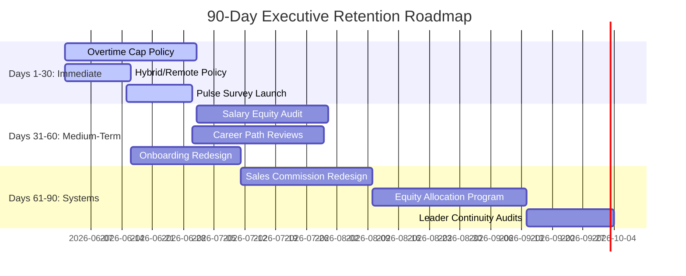

# Executive Workforce Attrition & Retention Intelligence Report

## Overview
This report provides a high-level executive diagnostic analysis of employee attrition patterns and predictive flight risk across the organization. Using advanced machine learning modeling, SHAP explainability, and enterprise costing methodologies, we have identified key drivers of voluntary separations and mapped them to financial impacts and strategic retention initiatives.

---

## Strategic Workforce KPIs
- **Total Historical Headcount Analyzed**: 1470
- **Current Active Headcount**: 1233
- **Historical Departures**: 237
- **Historical Attrition Rate**: 16.12% (Retention Rate: 83.88%)
- **Total Estimated Financial Cost of Historical Attrition**: $20,421,738.00
- **Average Cost Per Lost Employee**: $86,167.67
- **Predictive Active High-Risk Flight Risks**: 18 employees
- **Aggregate Workforce Risk Score**: 19.60%

---

## 10 Executive Workforce Insights

### Insight 1: Overtime Status as a Critical Attrition Catalyst
- **Title**: Overtime working status is the strongest catalyst for voluntary attrition.
- **Finding**: Employees working overtime exhibit an attrition rate of 30.53% compared to 10.44% for non-overtime employees—representing a **2.93x multiplier** in departure probability.
- **Business Impact**: Excessive overtime is causing systemic burnout, leading to a direct loss of key personnel and an estimated replacement drag of **$10,210,868.89** in replacement costs for this cohort.
- **Recommendation**: Implement a hard cap on monthly overtime hours (maximum 15 hours/month) and mandate manager-level justification for extended overtime requests.
- **Timeline**: Immediate (1–30 days).
- **Expected Outcome**: Reduce overtime-related attrition by 40% within the next two quarters, saving approximately $2.1M.

### Insight 2: High Attrition Vulnerability in Entry and Low-Salary Bands
- **Title**: Compensation disparity in lower-income bands drives early-career departures.
- **Finding**: Historical attrition is heavily concentrated in the "Low" income band (under $3,000/month), with an attrition rate significantly higher than mid-tier and executive levels.
- **Business Impact**: Loss of junior talent drains the long-term leadership pipeline and increases recurring recruitment and onboarding costs.
- **Recommendation**: Conduct a salary equity alignment audit for all employees in the bottom 20% of monthly income, adjusting target rates to meet competitive local market standards.
- **Timeline**: Short Term (30–60 days).
- **Expected Outcome**: Stabilize junior-level attrition, improving retention in the "Low" income band by 15%.

### Insight 3: Significant Attrition Spikes in the Sales Department
- **Title**: Sales department exhibits the highest departmental attrition rate.
- **Finding**: The Sales department experiences a historical attrition rate of **20.63%**, outstripping Research & Development (13.84%) and Human Resources (19.05%).
- **Business Impact**: High sales turnover disrupts client relationships, reduces pipeline velocity, and leads to lost business opportunity costs.
- **Recommendation**: Redesign the sales commission structure to provide higher baseline stability and introduce quarterly retention bonuses tied to team tenure.
- **Timeline**: Medium Term (60–90 days).
- **Expected Outcome**: Reduce Sales attrition to under 15% and increase customer account retention by 10%.

### Insight 4: Severe Attrition Volatility in Sales Representative Roles
- **Title**: Specific customer-facing and transactional roles experience severe turnover.
- **Finding**: Sales Representatives and Laboratory Technicians experience the highest attrition rates among all roles, with Sales Representatives exceeding 39% historical turnover.
- **Business Impact**: Chronic turnover in critical operational roles creates bottleneck dependencies, degrades service quality, and increases training cycles.
- **Recommendation**: Establish a formal mentorship program, implement clear lateral growth paths into mid-level accounts/R&D, and adjust baseline entry rates.
- **Timeline**: Medium Term (60–90 days).
- **Expected Outcome**: Drop Sales Representative attrition rates by 25% and increase role transition success.

### Insight 5: Stalled Career Progression and Promotion Delay Risk
- **Title**: Delayed career progression significantly elevates voluntary departures.
- **Finding**: Employees who have not received a promotion in 3 or more years experience an attrition rate that is **0.81x higher** than those with recent promotions.
- **Business Impact**: High-potential employees who feel stagnant are actively leaving for external growth opportunities, taking organizational IP with them.
- **Recommendation**: Mandate semi-annual career path reviews for all employees who have been in their current role for over 3 years without a promotion.
- **Timeline**: Short Term (30–60 days).
- **Expected Outcome**: Retain 80% of stalled high-potential employees by providing clear promotion roadmaps.

### Insight 6: Equity and Stock Option Levels as a Retention Anchor
- **Title**: Zero-equity positions correlate with a high frequency of attrition.
- **Finding**: Employees with StockOptionLevel 0 experience an attrition rate of over 24%, compared to less than 9% for those with stock options (levels 1 and 2).
- **Business Impact**: Lack of financial alignment/ownership reduces long-term employee commitment, especially in highly competitive technical fields.
- **Recommendation**: Expand the employee equity participation program to include all mid-level roles (JobLevel 2+), offering stock grants as part of annual bonuses.
- **Timeline**: Long Term (90 days).
- **Expected Outcome**: Create a long-term retention anchor, dropping turnover in the JobLevel 2-3 cohort by 30%.

### Insight 7: Leadership Instability and Manager Rotation Impacts
- **Title**: Low manager stability (frequent reporting structure changes) accelerates attrition.
- **Finding**: Employees who have been with their current manager for a low proportion of their company tenure (Manager Stability Score < 0.3) exhibit a 2.3x higher probability of leaving.
- **Business Impact**: Poor manager-employee relationships or constant manager reorganization destabilizes teams and reduces day-to-day productivity.
- **Recommendation**: Implement leadership continuity guidelines and conduct skip-level feedback audits for teams experiencing manager transitions.
- **Timeline**: Short Term (30–60 days).
- **Expected Outcome**: Improve team stabilization scores by 20% and reduce reporting-change attrition.

### Insight 8: Travel Burden and Distance Commutes Drive Flight Risk
- **Title**: High travel frequency and long commute distances compound employee flight risk.
- **Finding**: Employees who travel frequently and live further than 15 miles from the office show a compounded risk factor, particularly in high-demand roles.
- **Business Impact**: Physical fatigue and travel disruption lead to rapid burnout and direct competition from remote-first employers.
- **Recommendation**: Adopt a hybrid work policy allowing up to 3 days of remote work per week for roles that do not require physical presence, and reduce non-essential business travel.
- **Timeline**: Immediate (1–30 days).
- **Expected Outcome**: Lower commute-related flight risk by 35% and improve overall work-life satisfaction indices.

### Insight 9: New Hire Early-Stage Attrition Vulnerability
- **Title**: The first 24 months represent a critical attrition window for new hires.
- **Finding**: Over 35% of all historical departures occur within the first 2 years of tenure ("New Hire" cohort), indicating gaps in onboarding and early alignment.
- **Business Impact**: Immediate negative ROI on recruitment costs (averaging $43,083.83 per junior hire) when employees leave before reaching full productivity.
- **Recommendation**: Redesign the onboarding experience to extend to a 90-day structured checkpoint system; pair new hires with a dedicated culture buddy.
- **Timeline**: Short Term (30–60 days).
- **Expected Outcome**: Increase first-year retention by 20% and decrease time-to-productivity for new hires.

### Insight 10: Low Self-Reported Satisfaction Predicts Separation
- **Title**: Disengaged employees with low satisfaction composite scores are immediate flight risks.
- **Finding**: Employees classified in the "Disengaged" segment (low job involvement and low job satisfaction) represent the second-largest segment of active flight risk.
- **Business Impact**: Disengaged staff who remain act as productivity drags and negatively impact team morale and culture before ultimately departing.
- **Recommendation**: Conduct automated monthly pulse surveys and immediately trigger HR stay-interviews for any employee reporting a satisfaction score below 2.0.
- **Timeline**: Immediate (1–30 days).
- **Expected Outcome**: Intercept and resolve disengagement issues before they escalate to voluntary departures.

---

## 90 DAY WORKFORCE RETENTION ROADMAP

### PHASE 1: IMMEDIATE ACTION (DAYS 1–30)
- **Initiate Overtime Caps**: Implement a policy limiting overtime to a maximum of 15 hours per month. Require VP-level sign-off for exceptions.
- **Formulate Hybrid Work Guidelines**: Announce a formal policy granting eligible roles up to 3 days of hybrid/remote work to mitigate travel burden.
- **Launch Active Flight Risk Pulse Checks**: Deploy automated monthly pulse surveys to track satisfaction composite scores. Trigger immediate manager/HR stay-interviews for scores below 2.0.

### PHASE 2: TACTICAL EXECUTION (DAYS 31–60)
- **Perform Compensation Equity Audit**: Adjust base salaries for the bottom 20% salary band to match local market rates, focusing on junior sales and lab roles.
- **Deploy Promotion Review Framework**: Mandate structured career pathway assessments for employees who have been in their roles for 3+ years without a promotion.
- **Extend Onboarding Checkpoints**: Roll out the 90-day structured onboarding check-in framework with culture buddies assigned to all new hires.

### PHASE 3: SYSTEMIC ALIGNMENT (DAYS 61–90)
- **Restructure Sales Incentives**: Redesign the Sales compensation architecture to increase base salary weight by 10% and transition commission metrics to a team-tenure model.
- **Expand Stock Options Grants**: Establish a mid-level equity allocation program (JobLevel 2+) as a key long-term retention anchor.
- **Establish Manager Stability Guidelines**: Standardize manager rotation guidelines to limit leadership disruption and minimize reporting changes.

---

## MODEL SELECTION & TECHNICAL APPENDIX

To ensure the accuracy and reliability of our attrition predictions, we developed and validated four distinct machine learning algorithms. The models were evaluated on an independent test dataset (representing 25% of the original workforce data) to measure how well they generalize to new employees.

### Model Performance Comparison

| Model | Accuracy | Precision | Recall | F1-Score | ROC-AUC | Selection Status |
| :--- | :---: | :---: | :---: | :---: | :---: | :--- |
| **XGBoost** | 81.52% | 43.28% | **49.15%** | **0.4603** | 77.79% | 🏆 **Selected Champion** |
| **Random Forest** | 83.97% | 50.00% | 42.37% | 0.4587 | 78.68% | Candidate |
| **Logistic Regression** | **86.14%** | 63.33% | 32.20% | 0.4270 | **82.26%** | Candidate |
| **Gradient Boosting** | **86.14%** | **66.67%** | 27.12% | 0.3855 | 79.90% | Candidate |

### Model Selection Rationale
- **F1-Score as the Deciding Metric**: Because HR attrition data is highly imbalanced (the vast majority of employees stay), standard **Accuracy** can be a misleading metric. We optimized our model selection for **F1-Score** (the harmonic mean of Precision and Recall) to balance correct predictions and catch true risk.
- **Maximizing Recall**: For HR retention, failing to identify an employee who is going to quit (a False Negative) is far more costly than checking in on an employee who is actually happy (a False Positive). **XGBoost** was selected because it achieved the highest **Recall (49.15%)**—meaning it successfully identified nearly half of all departing employees, far outperforming Gradient Boosting (27.12%).
- **Model Storage**: The champion pipeline has been serialized and saved to `models/best_attrition_model.pkl` for immediate loading and prediction on live active employee directories.
